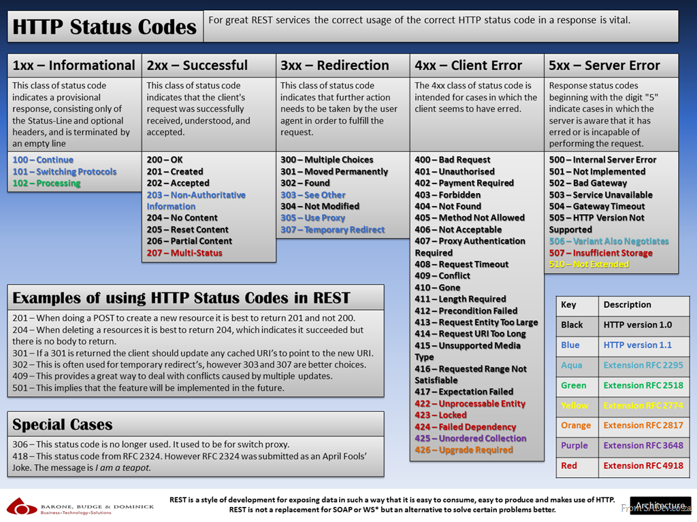

>使用Soarway.Hummer.Wizard.vsix模板创建项目大致分为以下几个步骤：

> 1. 设置NuGet程序包源管理。
> 2. 新建项目解决方案。
> 3. 创建DbSet。
> 4. 新建仓储接口。
> 5. 新建仓储实现。
> 6. EF Code First 使用命令创建数据库。
> 7. 新建服务接口
> 8. 新建服务实现
> 9. Restful API风格
> 10. Http Status Code 简介
> 11. 新建控制器

1. 设置NuGet程序包源管理 

   >打开Visual Studio 2017 点击工具->NuGet 包管理器->程序包管理器设置->程序包源->点击*绿色+的图标* 添加名称、添加源 源地址：http://192.168.0.214:8081/repository/nuget-public/

   

2. 新建项目解决方案
   
   >第一步，打开Visual Studio 2017点击文件 -> 选择新建 -> 选择项目 ->选择SoarwayHummer开发框架。输入你的项目名称、输入框架所在文件夹名称
   
   >第二步，**默认是IIS Express启动，修改为控制台应用程序启动选择项目的*.API** 

   >第三步，添加框架的XML文件*Soarway.Hummer.Core.API.xml*与项目*Soarway.Hummer.Demo.API.xml*文件。项目的XML生成方式见下图。选择*.API的项目右键->属性->生成 。见下图

   

   >第四步，修改数据库连接串，数据库连接串配置在*Config/Setting/common.core.config.json*。*dbCore*修改成自己的SQL Server数据库地址、账号、密码。

3. 创建DbSet

   >找到*Soarway.Hummer.Demo.DbSet*项目, 新建Student.cs用于定义实体。
   ```csharp
   public class Student
   {
      public int StudentID { get; set; }
      public DateTime Birthday { get; set; }
      public bool Gender { get; set; }
      public string Name { get; set; }
   }
   ```
   >找到*Soarway.Hummer.Demo.DbSetConfiguration*项目, 新建StudentConfiguration.cs用于修饰实体。

   ```csharp
   public class StudentConfiguration : IEntityTypeConfiguration<Student>
   {
      public void Configure(EntityTypeBuilder<Student> builder)
      {
         // table
         builder.ToTable(typeof(Student).Name);

         // key
         builder.HasKey(p => p.StudentID);

         // proprties
         builder.Property(p => p.Name).HasMaxLength(20).IsRequired();
         builder.Property(p => p.Gender).IsRequired();
         builder.Property(p => p.Birthday).HasDefaultValueSql("GETDATE()").IsRequired();
      }
   }
   ```

4. 新建仓储接口
   >找到*Soarway.Hummer.Demo.IRepository*项目，添加接口*IStudentRepository.cs*  IStudentRepository.cs接口的作用是框架未提供的接口在这边编写。继承*IBaseRepository<T>* IBaseRepository<T>底层实现了基础的增删改查的方法。只要接口继承了*IBaseRepository<T>* 就会有基础的方法。*T* 对象是DbSet里的具体对象名称

    ```csharp
    public interface IStudentRepository : IBaseRepository<Student>
    {

    }
   ```

5. 新建仓储实现
   >找到*Soarway.Hummer.Demo.Repository*项目，添加*StudentRepository.cs*继承  *BaseRepository<T>* 框架底层实现增删改查的方法和继承 *IStudentRepository.cs* 实现IStudentRepository.cs里的方法 *T* 对象是DbSet里的具体对象名称

   ```csharp
    public class StudentRepository : BaseRepository<Student>, IStudentRepository
    {
        public StudentRepository(DbContextCore dbContextCore) : base(dbContextCore)
        {
            _dbContextCore = dbContextCore;
        }
    }
   ```

6. EF Code First 使用命令创建数据库
   >框架使用的是EF Code First创建数据库。打开Visual Studio 2017 点击工具->NuGet 包管理器->程序包管理器控制台->输入命令 *add-migration initdb* 初始化数据库执行完后在执行 *update-database* 更新数据库成功。
   >深入学习EF Code First可以参考EF Code First官方文档 <a href="https://docs.microsoft.com/zh-cn/ef/ef6/get-started" target="_blank">EF Code First官方文档</a>

   

7. 新建服务接口

   >第一步，找到*Soarway.Hummer.Demo.IService*项目，添加*IStudentService.cs*接口文件, 并实现如下代码。

   >第二步，找到*Soarway.Hummer.Demo.DTO*项目，新建Student文件夹添加StudentCreateDTO.cs。使用DTO这种方式好处是每个业务有自己单独的DTO的方法互不影响各自的业务。

   >第三步，添加引用Soarway.Hummer.Core.Infrastructure;

   ```csharp
   public interface IStudentService
   {
      StatusResult AddStudent(StudentCreateDTO dto);
   }
   ```

8. 新建服务实现

   >第一步，找到*Soarway.Hummer.Demo.Service*项目，添加*StudentService.cs*文件, 并实现如下代码和引用。

   >第二步，添加AutoMapper、Soarway.Hummer.Core.Infrastructure、Soarway.Hummer.Core.DTO、Soarway.Hummer.Demo.DbSet、Soarway.Hummer.Demo.DTO、Soarway.Hummer.Demo.IRepository、Soarway.Hummer.Demo.IService等引用

   >第三步，添加*IStudentRepository*仓储注入

   ```csharp
   public class StudentService : IStudentService
   {
      IStudentRepository _studentRepository = null;
      public StudentService(IStudentRepository studentRepository)
      {
         _studentRepository = studentRepository;
      }
      public StatusResult AddStudent(StudentCreateDTO dto)
      {
         StatusResult statusResult = new StatusResult();
         Student student = Mapper.Map<StudentCreateDTO, Student>(dto);

         EffectCountDTO output = new EffectCountDTO() { EffectCount = _studentRepository.Create(student) };
         return statusResult.Ok("", "", output);
      }
   }
   ```
9.  Restful API风格

   ##什么是REST

   >1. REST 是 Representational State Transfer 的缩写. 它是一种架构的风格, 这种风格基于一套预定义的规则, 这些规则描述了网络资源是如何定义和寻址的.
   >2. RESTful 是目前最流行的 API 设计规范，用于 Web 数据接口的设计。
   >3. RESTful 的核心思想就是，客户端发出的数据操作指令都是"动词 + 宾语"的结构。比如，GET /articles这个命令，GET是动词，/articles是宾语。
   >4. 动词通常就是五种 HTTP 方法，对应 CRUD 操作。

   #### 接口的命名遵循Restful风格，通过Http Method来表达每个接口的行为，通过Restful API的语义化Url，可以较为直观的指导改API的功能。

   ```html
   GET（SELECT）：从服务器取出资源（一项或多项）。
   POST（CREATE）：在服务器新建一个资源。
   PUT（UPDATE）：在服务器更新资源（客户端提供改变后的完整资源）。
   PATCH（UPDATE）：在服务器更新资源（客户端提供改变的属性）。
   DELETE（DELETE）：从服务器删除资源。

   GET /zoos：列出所有动物园
   POST /zoos：新建一个动物园
   GET /zoos/ID：获取某个指定动物园的信息
   PUT /zoos/ID：更新某个指定动物园的信息（提供该动物园的全部信息）
   PATCH /zoos/ID：更新某个指定动物园的信息（提供该动物园的部分信息）
   DELETE /zoos/ID：删除某个动物园
   GET /zoos/ID/animals：列出某个指定动物园的所有动物
   DELETE /zoos/ID/animals/ID：删除某个指定动物园的指定动物
   ```

  #### 想更深入学习RESTful可以参考以下文章内容：
  ><a href="http://www.ruanyifeng.com/blog/2018/10/restful-api-best-practices.html" target="_blank">RESTful API 最佳实践</a>
  ><a href="http://www.ruanyifeng.com/blog/2014/05/restful_api.html" target="_blank">RESTful API 设计指南</a>
  ><a href="https://www.cnblogs.com/cgzl/p/9010978.html" target="_blank">用ASP.NET Core 2.0 建立规范的 REST API -- 预备知识</a>
  ><a href="https://www.cnblogs.com/cgzl/p/9019314.html" target="_blank">用ASP.NET Core 2.0 建立规范的 REST API -- 预备知识 (2) + 准备项目</a>
  ><a href="https://www.cnblogs.com/cgzl/p/9047626.html" target="_blank">用ASP.NET Core 2.0 建立规范的 REST API -- GET 和 POST</a>
  ><a href="https://www.cnblogs.com/cgzl/p/9080960.html" target="_blank">用ASP.NET Core 2.0 建立规范的 REST API -- DELETE, UPDATE, PATCH 和 Log</a>
  ><a href="https://www.cnblogs.com/cgzl/p/9117448.html" target="_blank">用ASP.NET Core 2.1 建立规范的 REST API -- 翻页/排序/过滤等</a>

10.  Http Status Code 简介
  * 1xx, 用于通知报告.
  * 2xx, 表示响应是成功的, 例如 200 OK, 201 Created, 204 No Content.
  * 3xx, 表示某种重定向, 
  * 4xx, 表示客户端引起的错误, 例如 400 Bad Request, 401 Unauthorized, 404 Not Found
  * 5xx, 表示服务器错误, 例如 500 Internal Server Error.

  ### 具体的可以查看该张图
   

11. 新建控制器

  >第一步，找到*Soarway.Hummer.Demo.API*项目，点击Controllers文件夹，添加->控制器->选择 *API 控制器 - 空* 。将该*Controller*继承至*BaseController*

  >第二步，注入 *IStudentService*服务。

  >帮三步，添加Soarway.Hummer.Core.DTO、Soarway.Hummer.Core.Infrastructure、Soarway.Hummer.Demo.DTO、Soarway.Hummer.Demo.IService、System.ComponentModel等引用。

  >第四步，找到*Soarway.Hummer.Demo.Infrastructure*项目，点击Mapper文件夹，找到*BizMapper.cs* 添加AutoMapper关系,并实现如下代码。

   ```csharp
   public class BizMapper : ISoarwayMapper
   {
      public void Init(IMapperConfigurationExpression cfg)
      {
         // 在此输入DbSet与DTO之间的映射关系
         InitStudent(cfg);
      }
      public void InitStudent(IMapperConfigurationExpression cfg)
      {
         cfg.CreateMap<Student, StudentCreateDTO>().ReverseMap();
      }
   }
   ```
  >第五步，Controller代码实现如下:

  ```csharp
   [Route("api/[controller]")]
   [ApiController]
   public class StudentController : ControllerBase
   {
      IStudentService _studentService;
      public StudentController(IStudentService studentService)
      {
         _studentService = studentService;
      }
      /// <summary>
      /// 新增 - 学生信息
      /// </summary>
      /// <param name="dto">新增DTO</param>
      /// <returns></returns>
      [Description("新增 - 学生信息")]
      [HttpPost]
      [ProducesResponseType(typeof(EffectCountDTO), StatusCodes.Status200OK)]
      public IActionResult Post([FromBody]StudentCreateDTO dto)
      {
         StatusResult statusResult = _studentService.AddStudent(dto);

         return new JsonResult(statusResult);
      }
   }
  ```

  >第六步，接口返回值

  ```javascript
   {
      "EffectCount": 1
   }
  ```
  >第七步，至此框架的搭建就此完成，启动Swagger调用接口测试。

