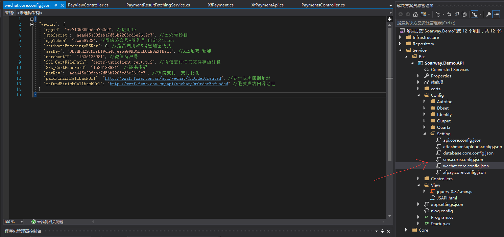
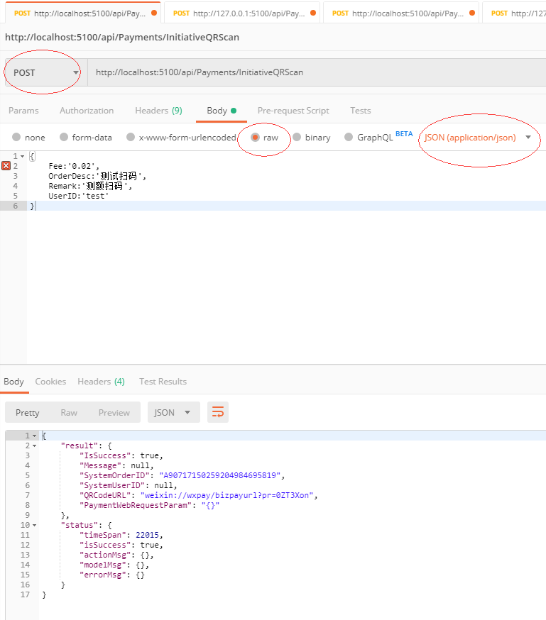
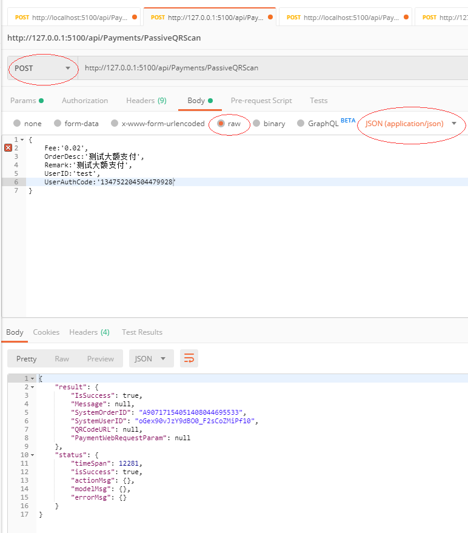
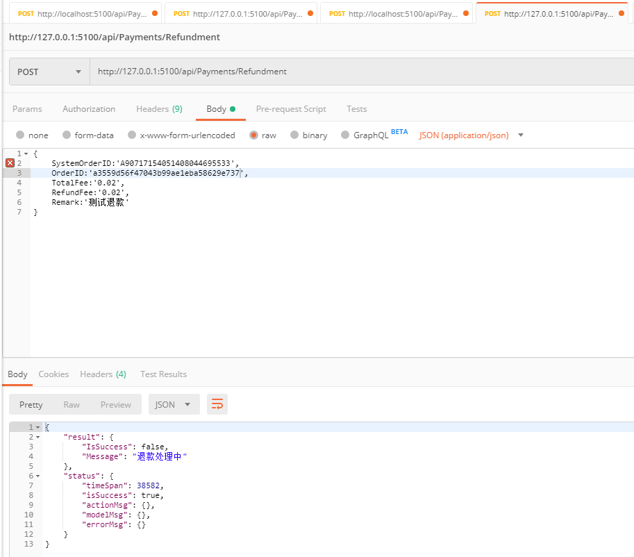
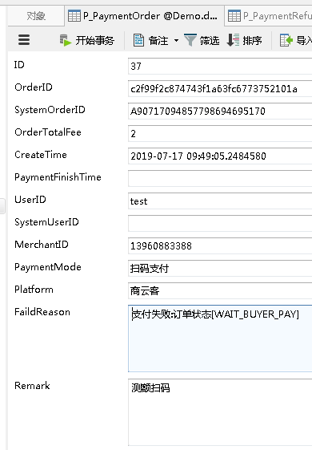
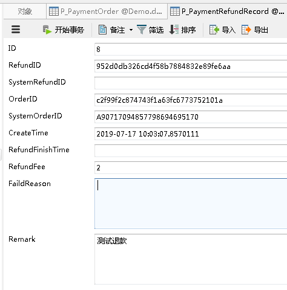
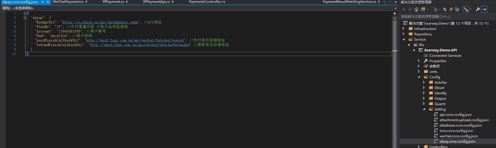

目前框架支持官方微信，商云客两种支付平台，下列文档将分别介绍微信和商云客的使用以及配置方法

# 微信篇:

## `1.配置`

微信商户官方配置此文档内不细说，官网上全都有，如果要使用微信支付，大概步骤是注册一个微信商户账号，过审，绑定公众号或者小程序，设置支付秘钥，支付目录。。。此处省略无数字，都弄完之后需要将几个关键的东西抽出来记下，后续框架配置会用到。

如图所示配置，可以看到配置文件存放的位置，

每个配置是干嘛用的截图里都有，其中，`activateEncodingAESKey，aesKey，appToken`这3个可以不用配
微信支付需要用到一个`支付证书`，要放在项目中的certs文件夹内，正如上图中SSL_CertFilePath配的一样。
接下来讲几个主要的支付功能接口，下面会挨个使用Postman工具举例如何请求这些接口，演示入参和出参格式，以及其他注意事项。

`注意：下文中所有截图中出现的入参全都是必传参数，支付接口没有非必传的，全部都是必传的！`

## `2.接口`
## 买家扫卖家：  



## 入参：  

Fee&emsp;`string`&emsp;只能传数字，如果是微信模式必须转成分为单位，例如100块钱你得填10000  
OrderDesc&emsp;`string`&emsp;订单描述  
Remark&emsp;`string`&emsp;订单备注  
UserID&emsp;`string`&emsp;我方业务系统里的用户ID

## 出参：  

IsSuccess&emsp;`bool`&emsp;请求成败  
Message&emsp;`string`&emsp;如果请求失败，则这个字段会告诉你啥原因失败的  
SystemOrderID&emsp;`string`&emsp;仅当请求成功时有值，表示支付系统内部订单号  
SystemUserID&emsp;`string`&emsp;仅当请求成功且接口类型为“应用内发起支付” 或 “卖家扫买家”才有值，表示支付系统内部用户ID，比如微信&OpenID  
QRCodeUrl&emsp;`string`&emsp;
仅当支付渠道使用的是官方微信且接口为“买家扫卖家”，“应用内发起支付”，或者商客云支付渠道下的“卖家扫买家”，“应用内发起支付”接口，才有值。表示二维码链接地址，前端需要自行通过第三方库将这个地址转换成二维码图片，让买家去扫这个图片  
PaymentWebRequestParam&emsp;`string`&emsp;
仅当请求成功且类型为“应用内发起支付”才有值，表示前端页面跳转到支付流程的这次请求，需要用到的请求参数串。

## 付款码支付:  

## 入参:  

Fee&emsp;`string`&emsp;只能传数字，如果是微信模式必须转成分为单位，例如100块钱你得填10000  
OrderDesc&emsp;`string`&emsp;订单描述  
Remark&emsp;`string`&emsp;订单备注  
UserID&emsp;`string`&emsp;我方业务系统里的用户ID  
UserAuthCode&emsp;`string`&emsp;付款授权码

## 出参:  

IsSuccess&emsp;`bool`&emsp;请求成败  
Message&emsp;`string`&emsp;如果请求失败，则这个字段会告诉你啥原因失败的  
SystemOrderID&emsp;`string`&emsp;仅当请求成功时有值，表示支付系统内部订单号  
SystemUserID&emsp;`string`&emsp;仅当请求成功且接口类型为“应用内发起支付” 或 “卖家扫买家”才有值，表示支付系统内部用户ID，比如微信&OpenID  
QRCodeUrl&emsp;`string`&emsp;
仅当支付渠道使用的是官方微信且接口为“买家扫卖家”，“应用内发起支付”，或者商客云支付渠道下的“卖家扫买家”，“应用内发起支付”接口，才有值。表示二维码链接地址，前端需要自行通过第三方库将这个地址转换成二维码图片，让买家去扫这个图片  
PaymentWebRequestParam&emsp;`string`&emsp;
仅当请求成功且类型为“应用内发起支付”才有值，表示前端页面跳转到支付流程的这次请求，需要用到的请求参数串。

## 应用内发起支付:  
首先必须要新建一个视图页面，必备如下代码
```js
<script src="https://code.jquery.com/jquery-3.4.1.min.js"></script>
    <script src="http://res.wx.qq.com/open/js/jweixin-1.4.0.js"></script>
    <script type="text/javascript">
        var requestParam = "";
        $(function () {

            var settings = {
                "async": true,
                "crossDomain": true,
                "url": "http://wxzf.fzxs.com.cn/api/Payments/JSAPI",
                "method": "POST",
                "headers": {
                    "Content-Type": "application/json",
                    "cache-control": "no-cache"
                },
                "data": "{Fee:'0.02',OrderDesc:'测试JSAPI',Remark:'测试JSAPI',UserID:'test',SystemUserID:'op72i5-PGsJnbaJpS5CfA2oGJU3w'}"
            }

            $.ajax(settings).done(function (res) {
                //alert(JSON.stringify(res));
                if (res.result.IsSuccess == true) {
                    requestParam = JSON.parse(res.result.PaymentWebRequestParam);
                    alert("支付订单创建成功，现在可以点击立即支付了");
                } else {
                    alert(res.result.Message);
                }
            });
        });
        //调用微信JS api 支付
        function jsApiCall() {
            WeixinJSBridge.invoke(
                'getBrandWCPayRequest',
                requestParam,//预支付请求参数串
                function (res) {
                    if (res.err_code) {
                        alert('错误码：' + res.err_code + '，错误描述：' + res.err_desc + '，错误消息：' + res.err_msg);
                        WeixinJSBridge.log(res.err_msg);
                        //alert('错误码：' + res.err_code + '，错误描述：' + res.err_desc + '，错误消息：' + res.err_msg);
                    }
                }
            );
        }

        function callpay() {
            if (typeof WeixinJSBridge == "undefined") {
                if (document.addEventListener) {
                    document.addEventListener('WeixinJSBridgeReady', jsApiCall, false);
                }
                else if (document.attachEvent) {
                    document.attachEvent('WeixinJSBridgeReady', jsApiCall);
                    document.attachEvent('onWeixinJSBridgeReady', jsApiCall);
                }
            }
            else {
                jsApiCall();
            }
        }
    </script>
```

如果使用的是Razor则requestParam要动态渲染成JSAPI接口返回的参数串，前端设计一个支付按钮调用callpay方法即可。
此接口必须在微信商户后台设置支付目录，假设支付页面路径是http://www.baidu.com/api/pay/view
那么支付目录要设置http://www.baidu.com/api/pay/

## 申请退款:  

## 入参:  

SystemOrderID&emsp;`string`&emsp;支付系统内部订单号  
OrderID&emsp;`string`&emsp;我方业务系统订单号  
TotalFee&emsp;`string`&emsp;订单总额，只能传数字，如果是微信模式必须转成分为单位，例如100块钱你得填10000   
RefundFee&emsp;`string`&emsp;退款金额，只能传数字，如果是微信模式必须转成分为单位，例如100块钱你得填10000   
Remark&emsp;`string`&emsp;备注

## 出参:  

IsSuccess&emsp;`bool`&emsp;请求成败  
Message&emsp;`string`&emsp;如果请求失败，则这个字段会告诉你啥原因失败的  


## `3.数据库介绍`


ID&emsp;自增主键  
OrderID&emsp;业务系统订单号  
SystemOrderID&emsp;支付系统内部订单号  
OrderTotalFee&emsp;订单总额  
CreateTime&emsp;创建时间  
PaymentFinishTime&emsp;支付完成时间  
UserID&emsp;业务系统用户ID  
SystemUserID&emsp;支付系统用户ID  
MerchantID&emsp;商户号  
PaymentMode&emsp;支付模式(扫码支付，被扫码支付，应用内支付)  
Platform&emsp;支付渠道名称（微信，商云客）	
FaildReason&emsp;失败原因，仅当支付接口出错，请求失败或种种原因导致付款失败才会有值  
Remark&emsp;备注



ID&emsp;自增主键  
RefundID&emsp;业务系统退款单号  
SystemRefundID&emsp;支付系统内部退款单号  
OrderID&emsp;业务系统订单号  
SystemOrderID&emsp;支付系统内部订单号  
CreateTime&emsp;创建时间  
RefundFinishTime&emsp;退款成功时间  
RefundFee&emsp;退款金额  
FaildReason&emsp;失败原因，仅当支付接口出错，请求失败或种种原因导致付款失败才会有值  
Remark&emsp;备注


# 商云客篇:
关于如何注册商云客，如何go审核，此处省略无数字。。。

## `1.配置`


都有注释的，不解释。这里只说一点，商云客的配置文件`可以不配paidFinishCallbackUrl 和 refundFinishCallbackUrl 这2个参数`，因为这个平台真的很坑爹，用回调完全是多此一举，目前支付系统已经通过队列轮询实现了付款和退款结果的更新，微信那边也挺坑爹的，一部分数据只有主动查询才能查的到，当作者意识到这一点的时候，回调接口已经开发完了，也舍不得删代码，所以，`微信的要配回调地址，商云客不用配`。  
另外，关于`PlatNo`这个参数，请参考商云客官方文档 附录 部门有讲解，支持的渠道代码非常多，此处就不贴出来了，一切以官方最新文档为准。目前我们系统只用37（合利宝微信），其他的公司暂时不考虑。  
`BseApiUrl`这个参数也得根据官方最新文档来，没准哪天就变了，商云客所有支付接口都是这个，他们是通过接口中的一个参数来区分不同功能的。

#3 `2.关于JSAPI应用内支付接口`
和微信一样需要设置支付目录，不过商云客的不能在微信商户里设置，而要将商云客的商户号+支付目录路径发给商云客官方负责人，他们帮你加才行