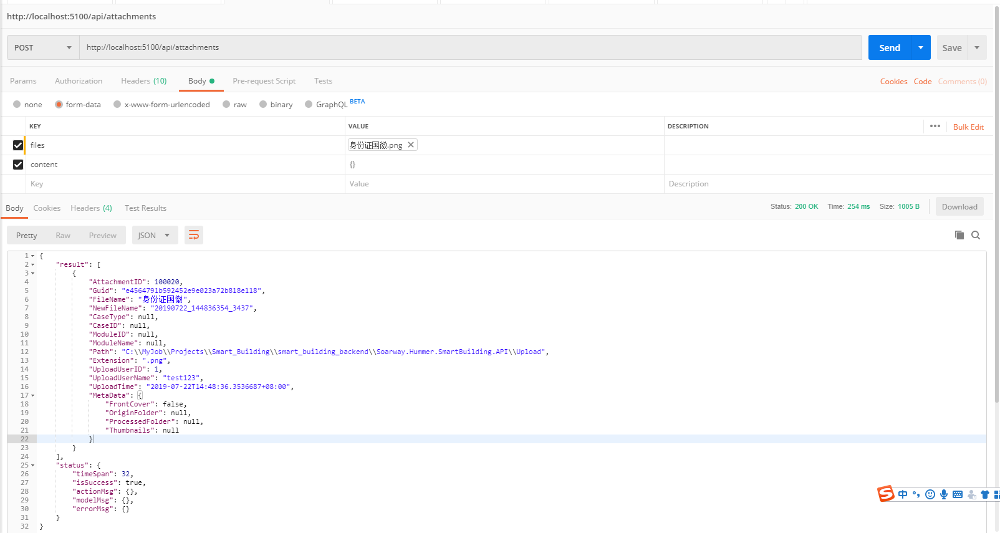
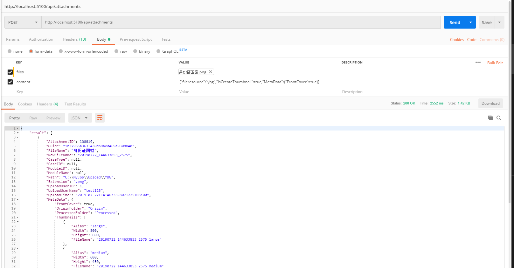
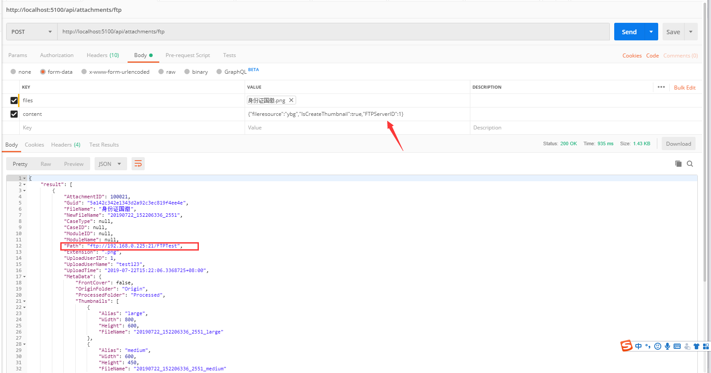
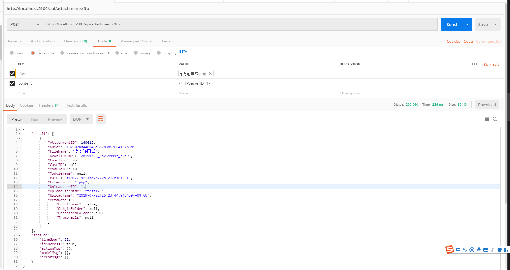
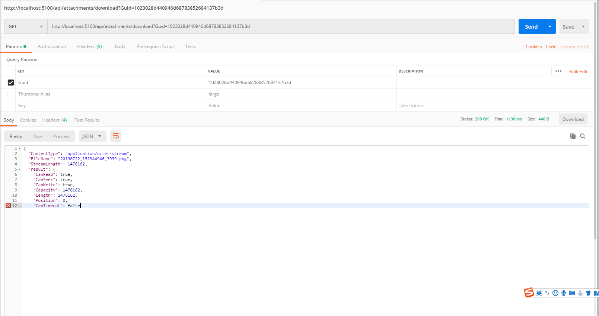

>附件统一上传接口

1.**功能介绍**：提供附件上传、下载、生成缩略图、附件上传记录查询功能，支持上传文件至应用服务器以及指定FTP服务器，上传附件大小限制：100MB。  
> 注意：.NET Core 中RequestBody的默认限制大小为30,000,000 bytes = 28.6MB，可以在接口上添加标签RequestSizeLimit来控制上传文件的大小，如下代码段：  

```csharp
[RequestSizeLimit(100000000)]//单位bytes = 100MB
public IActionResult Post(IList<IFormFile> files)
{

}
```

2.**参数配置**：配置文件 `common.core.config.json` 对不同的`文件系统`以及`FTP服务器`进行附件上传相关配置，具体参数说明如下：
```javascript
{
  "components": [
    {
      "fileresource": "YBG",
      "rootpath": "C:\\MyJob\\Upload\\YBG",
      "requestpath": "MyJob/Upload/YBG",
      "originfolder": "",
      "processedfolder": ""
    },
    {
      "fileresource": "WWZ",
      "rootpath": "Upload/WWZ",
      "requestpath": "Upload/WWZ",
      "originfolder": "",
      "processedfolder": ""
    }
  ],
  "ftpservers": [
    {
      "id": 1,
      "ip": "192.168.0.225:21/FTPTest",
      "userid": "administrator",
      "password": "fzxs@2003@oaServer"
    }
  ]
}
```
| 节点                          | 注释                                                                                                                                                                                                    |
|:------------------------------|:--------------------------------------------------------------------------------------------------------------------------------------------------------------------------------------------------------|
| components[i].fileresource    | 文件来源，主要用于区分不同文件系统（如：微网站、智慧楼宇、第三方系统等）上传的文件，同时作为文件上传时查找相关配置的依据，如文件上传时指明文件来源为WWZ，则对应配置中的第二个选项，`必填，暂不支持中文` |
| components[i].rootpath        | 文件保存路径，可以是相对路径也可以是绝对路径，`必填`                                                                                                                                                    |
| components[i].requestpath     | 文件虚拟路径，作为浏览器访问文件时的部分http地址，如：http://localhost:5100/`requestpath`/yyyyMM/filename.png，未填写时截取roopath去除盘符(绝对路径)的部分，如上述事例，`选填`                          |
| components[i].originfolder    | 原始文件所在文件夹名称，当文件需要经过处理并将原文件和处理后的文件分开保存时，此文件夹下保存原始文件，如生成缩略图 `选填`                                                                               |
| components[i].processedfolder | 处理后文件所在文件夹名称，当文件需要经过处理并将原文件和处理后的文件分开保存时，此文件夹下保存处理过后的文件，如生成缩略图 `选填`                                                                       |
| ftpservers[i].id              | FTP服务器唯一标识，整数类型，`必填`                                                                                                                                                                     |
| ftpservers[i].ip              | FTP服务器地址 `必填`                                                                                                                                                                                    |
| ftpservers[i].userid          | FTP服务器账号 `必填`                                                                                                                                                                                    |
| ftpservers[i].password        | FTP服务器密码 `必填`                                                                                                                                                                                    |
3.**接口 IFileProvider 使用说明**：此接口提供附件处理相关方法，如生成缩略图等，包含默认的附件处理实例`DefaultProvider`，支持重载，若默认的处理方式无法满足实际要求可自定义，如下：
```csharp
public class TestProvicer : DefaultProvider, IFileProvider
{
    public override List<ImageDTO> ImageProcess(string filePath, string path, string folder)
    {
        //return base.ImageProcess(filePath, path, folder);
        //自定义内容
    }
}
```
3.1 **供重写的属性以及方法说明**  

| 属性或方法名   | 类型 | 注释                               | 默认值                                                                |
|:---------------|:-----|:-----------------------------------|-----------------------------------------------------------------------|
| ImageSizes     | 属性 | 图片尺寸列表，可用于图片压缩       | 默认三个尺寸，大[large]:800×600；中[medium]:600×450;小[small]:200×150 |
| ImageProcess   | 方法 | 文件处理方法，返回处理后的文件列表 | 图片压缩，根据上一个属性进行不同尺寸的压缩                            |
| ImageProcess   | 方法 | 图片压缩方法，返回文件流           | 图片压缩，根据参数指定大小                                            |
| FileNameFormat | 方法 | 文件名格式化方法                   | 文件名格式化，格式：文件名_yyyyMMddHHmmssfff_随机数.扩展名            |

4.**API调用**

4.1.**上传附件接口**

*接口地址*：`api/attachments`  
*请求方式*：`POST`  
*接口权限*：`token有效验证`  
*请求格式*：`form-data`  
*请求参数*：
  
| 参数名  | 参数类型           | 注释                                         |
|:--------|:-------------------|----------------------------------------------|
| files   | IList<`IFormFile`> | 附件列表，可上传多个附件，`必填`             |
| content | json-str           | 附件属性，对应 `AttachmentCreateDTO`，`选填` |

`AttachmentCreateDTO` 包含以下属性：

| 属性名            | 属性类型                | 注释                                                                                                      |
|:------------------|:------------------------|-----------------------------------------------------------------------------------------------------------|
| CaseID            | string                  | 业务ID，`选填`                                                                                            |
| CaseType          | string                  | 业务类型，`选填`                                                                                          |
| ModuleID          | string                  | 模块ID，`选填`                                                                                            |
| ModuleName        | string                  | 模块名称，`选填`                                                                                          |
| FileResource      | string                  | 文件系统，对应配置 `common.core.config.json`，`选填`，未填写时附件默认存储到程序所在目录的`Upload` 文件夹 |
| IsCreateThumbnail | bool                    | 是否需要创建缩略图，`选填`                                                                                |
| FTPServerID       | int                     | FTP服务器唯一标识，使用FTP上传附件时填写，`选填`                                                          |
| MetaData          | `AttachmentMetaDataDTO` | 扩展元数据，用于扩展不同系统需要的特殊属性，`选填`                                                        |


`AttachmentMetaDataDTO` 包含以下属性：

| 属性名          | 属性类型         | 注释                                                                     |
|:----------------|:-----------------|--------------------------------------------------------------------------|
| FrontCover      | bool             | 是否作为封面，`选填`                                                     |
| OriginFolder    | string           | 原文件保存文件夹名称，`作为返回结果，上传时不必填`                       |
| ProcessedFolder | string           | 处理后文件保存的文件夹名称，如缩放后的图片，`作为返回结果，上传时不必填` |
| Thumbnails      | List<`ImageDTO`> | 缩略图列表，`作为返回结果，上传时不必填`                                 |

`ImageDTO` 包含以下属性：

| 属性名   | 属性类型 | 注释                     |
|:---------|:---------|--------------------------|
| Alias    | string   | 别名，如：large、small等 |
| Width    | int      | 缩略图宽度               |
| Height   | int      | 缩略图高度               |
| FileName | string   | 缩略图名称               |

*返回结果*：上传成功返回附件列表 `List<AttachmentQueryResultDTO>`，包含以下属性：

| 属性名         | 属性类型                | 注释                                                                                                                 |
|:---------------|:------------------------|----------------------------------------------------------------------------------------------------------------------|
| AttachmentID   | int                     | 附件ID                                                                                                               |
| Guid           | string                  | 附件唯一标识                                                                                                         |
| NewFileName    | string                  | 附件重命名名称                                                                                                       |
| FileName       | string                  | 附件原名称                                                                                                           |
| CaseID         | string                  | 业务ID                                                                                                               |
| CaseType       | string                  | 业务类型                                                                                                             |
| ModuleID       | string                  | 模块ID                                                                                                               |
| ModuleName     | string                  | 模块类型                                                                                                             |
| Path           | string                  | 附件路径（FTP路径或绝对路径），`生成规则：（components.rootpath 或 ftpservers.ip）/ModuleName/CaseType/yyyyMM(日期)` |
| VirtualPath    | string                  | 附件相对路径，`生成规则：（components.requestpath）/ModuleName/CaseType/yyyyMM(日期)`                                |
| Extension      | string                  | 附件扩展名，如：.jpg                                                                                                 |
| UploadUserID   | string                  | 上传附件的用户ID，`token中获取`                                                                                      |
| UploadUserName | string                  | 上传附件的用户名，`token中获取`                                                                                      |
| UploadTime     | string                  | 上传时间                                                                                                             |
| MetaData       | `AttachmentMetaDataDTO` | 扩展元数据                                                                                                           |

*调用实例*：





4.2.**FTP上传附件接口**

*接口地址*：`api/attachments/ftp`  
*请求方式*：`POST`  
*接口权限*：`token有效验证`  
*请求格式*：`form-data`  
*请求参数*：与上传附件接口基本一致，不同在于使用FTP上传附件时必须填写`FTPServerID`，与配置文件对应，用于查找指定FTP服务器

*返回结果*：与上传附件接口一致

*调用实例*：





4.3.**下载附件接口**

*接口地址*：`api/attachments`  
*请求方式*：`GET`  
*接口权限*：`token有效验证`  
*请求格式*：`FromQuery`  
*请求参数*：  

| 参数名         | 参数类型 | 注释                                 |
|:---------------|:---------|--------------------------------------|
| Guid           | string   | 附件唯一标识，`必填`                 |
| ThumbnailAlias | string   | 缩略图别名，填写时下载缩略图，`选填` |
*返回结果*：`MemoryStream`

*调用实例*：



> 特别说明：下载附件涉及权限控制

4.4.**获取 - 附件上传记录 - 单条**  

*接口地址*：`api/attachments/{attachmentID:int:min(1)}`  
*请求方式*：`GET`  
*接口权限*：`token有效验证`  
*请求格式*：`FromQuery`   
*返回结果*：`AttachmentQueryResultDTO`

4.5.**获取 - 附件上传记录 - 列表**  

*接口地址*：`api/attachments/list`  
*请求方式*：`GET`  
*接口权限*：`token有效验证`  
*请求格式*：`FromQuery`    
*请求参数*：

| 参数名          | 参数类型 | 注释                 |
|:----------------|:---------|----------------------|
| Guid            | string   | 附件唯一标识，`必填` |
| FileName        | string   | 原始文件名           |
| NewFileName     | string   | 重命名的文件名       |
| CaseType        | string   | 业务类型             |
| CaseID          | string   | 业务ID               |
| ModuleID        | string   | 模块ID               |
| ModuleName      | string   | 模块名称             |
| UploadUserID    | int      | 上传用户ID           |
| UploadUserName  | string   | 上传用户名           |
| UploadTimeBegin | datetime | 上传开始时间         |
| UploadTimeEnd   | datetime | 上传结束时间         |
| FrontCover      | string   | 是否作为封面         |

*返回结果*：List<`AttachmentQueryResultDTO`>

4.6.**获取 - 附件上传记录 - 分页**  

*接口地址*：`api/attachments/num/{num:int:min(1)}/size/{size:int:min(1):max(500)}`  
*请求方式*：`GET`  
*接口权限*：`token有效验证`  
*请求格式*：`FromQuery`     
*请求参数*：同上  
*返回结果*：List<`AttachmentQueryResultDTO`>

4.7.**删除 - 附件**  

*接口地址*：`api/attachments`  
*请求方式*：`Delete`  
*接口权限*：`token有效验证`  
*请求格式*：`FromBody`     
*请求参数*：  

| 参数名        | 参数类型    | 注释                                                                                                    |
|:--------------|:------------|---------------------------------------------------------------------------------------------------------|
| AttachmentIDs | List`<int>` | 上传附件记录ID列表，支持批量删除，`必填`                                                                |
| IsDeleteFile  | bool        | 是否删除文件（false：只删除上传记录不删除文件，true：删除记录的同时也删除文件，默认不删除文件），`选填` |

*返回结果*：`EffectCountDTO`，受影响的行