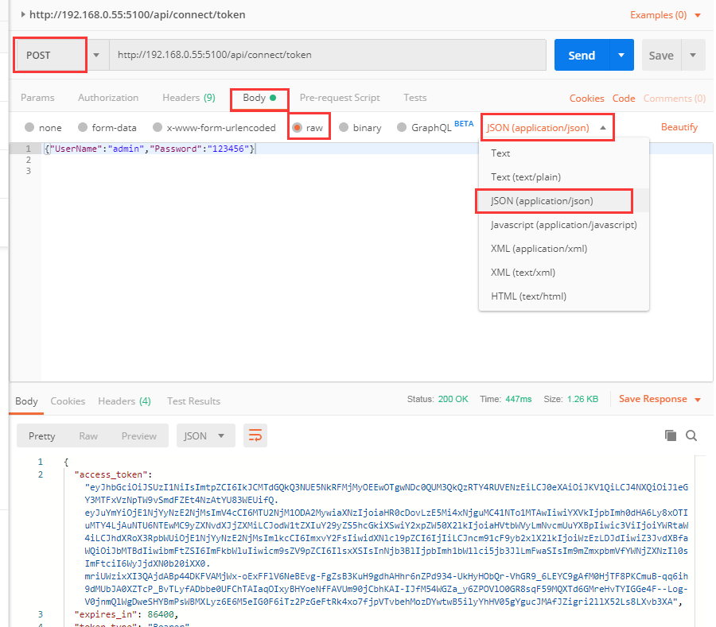

如何获取Token

**Identity Server 4介绍**

Identity Server 4是ASP.NET Core 2的OpenID Connect和OAuth 2.0框架，可以做的功能有单点登陆、Api 身份验证、授权服务、EntityFramework的配置的支持、登录注销等。它是一个开源的项目，最重要的是Identity Server 4可以由你自己定制来适应你的解决方案。

**安装Identity Server 4**

打开Visual Studio 2017 选择**工具->NeGet包管理器->程序包管理器控制台**安装:

```
Install-Package IdentityServer4 -Version 2.4.0
```
数据库**P_User**表添加一条用户的测试数据 
| 字段     | 值                                          |
| :------- | :------------------------------------------ |
| UserName | test123                                     |
| Password | 42a2f0d93b70cafb49963f8238693b47(*md5加密*) |

调用 **http://localhost:5100/.well-known/openid-configuration** 能调成功这个界面说明token配置成功。


**获取Token**

调用 **http://localhost:5100/connect/token** 

**http://localhost:5100** 地址配置在appSetting.json节点system.url配置的地址

Body设置**from-data**格式

```javascript
    client_id:hummer.core.api
    client_secret:secret
    grant_type:password
    username:test123
    password:123456
```

| 节点          | 注释                                                                                  |
| :------------ | :------------------------------------------------------------------------------------ |
| client_id     | hummer.core.api (配置在**appSetting.json**节点identityServerConfig.resources[i].name) |
| client_secret | secret                                                                                |
| grant_type    | password (账号密码方法验证)                                                           |
| username      | test123 (P_User表的用户名)                                                            |
| password      | 123456 (P_User表的密码)密码写到数据库是是md5加密的在postman请求的时候可以明文         |




**获取refresh_token配置**

Body设置**from-data**格式

```javascrpit
    client_id:hummer.core.api
    client_secret:secret
    grant_type:refresh_token
    refresh_token:8e8ce2e1cfce2b1f699c0a8419ca3490cddf691d83d4846aa2300f3857708116
```

| 节点          | 注释                                                                                  |
| :------------ | :------------------------------------------------------------------------------------ |
| client_id     | hummer.core.api (配置在**appSetting.json**节点identityServerConfig.resources[i].name) |
| client_secret | secret                                                                                |
| grant_type    | refresh_token (上面获取的**refresh_token**)                                           |
| refresh_token | 8e8ce2e1cfce2b1f699c0a8419ca3490cddf691d83d4846aa2300f3857708116                      |


到这里token和refresh_token就获取完成了。

获取的access_token数据可以在[https://jwt.io/] 解码出来,access_token里放的数据尽量不要是重要的数据。

**使用方式**
请求接口在在http headers里设置

| Key          | VALUE                   |
| :------------ | :--------------------- |
| Authorization | Bearer 空格accesstoken |
|               |