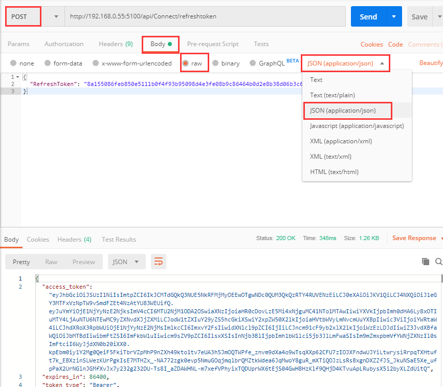

####如何获取Token

**Identity Server 4介绍**

IdentityServer4 是为ASP.NET Core 2.系列量身打造的一款基于 OpenID Connect 和 OAuth 2.0 认证框架。
将identityserver部署在你的应用中，具备如下的特点

1. 认证服务
   >可以为你的应用（如网站、本地应用、移动端、服务）做集中式的登录逻辑和工作流控制。IdentityServer是完全实现了OpenID Connect协议标准。

2. 单点登录登出(SSO)
   >在各种类型的应用上实现单点登录登出。

3. API访问控制
   >为各种各样的客户端颁发access token令牌,如服务与服务之间的通讯、网站应用、SPAS和本地应用或者移动应用。

4. 联合网关
   >支持来自Azure Active Directory, Google, Facebook这些知名应用的身份认证，可以不必关心连接到这些应用的细节就可以保护你的应用。

5. 专注于定制
   >最重要的是identityserver可以根据需求自行开发来适应应用程序的变化。identityserver不是一个框架、也不是一个盒装产品或一个saas系统，您可以编写代码来适应各种场景。

 #### 更深入学习IdentityServer4可以参考以下文章内容：
  ><a href="http://www.identityserver.com.cn/" target="_blank">IdentityServer4中文文档</a>

  ><a href="https://www.cnblogs.com/stulzq/p/8119928.html" target="_blank">IdentityServer4 中文文档与实战</a>

  ><a href="https://www.cnblogs.com/franhome/p/8811559.html" target="_blank">IdentityServer4-介绍大纲</a>
  
  ><a href="https://www.cnblogs.com/cgzl/p/7780559.html" target="_blank">使用Identity Server 4建立Authorization Server</a>


**安装Identity Server 4**

打开Visual Studio 2017 选择**工具->NeGet包管理器->程序包管理器控制台**安装:

```
Install-Package IdentityServer4 -Version 2.4.0
```

数据库**SPUser**表添加一条用户的测试数据 

| 字段     | 值                                          |
| :------- | :------------------------------------------ |
| UserName | admin                                       |
| Password | 42a2f0d93b70cafb49963f8238693b47(*md5加密*) |

**http://localhost:5100** 地址配置在appSetting.json节点system.url配置里的地址

调用 **http://localhost:5100/.well-known/openid-configuration** 能调成功这个界面说明token配置成功。


**获取Token**

调用 **http://localhost:5100/api/connect/token** 

Body选择raw **JSON(application/json)** 格式

```javascript
    {"UserName":"admin","Password":"123456"}
```


**获取refresh_token配置**

调用 **http://localhost:5100/api/Connect/refreshtoken** 

Body选择raw **JSON(application/json)** 格式

```javascript
    {"RefreshToken": ""}
```



到这里token和refresh_token就获取完成了。

获取的access_token数据可以在[https://jwt.io/] 解码出来,access_token里放的数据尽量不要是重要的数据。

**使用方式**
请求接口在在http headers里设置

| Key           | VALUE                  |
| :------------ | :--------------------- |
| Authorization | Bearer 空格accesstoken |
|               |

**Token可以选择存到Redis还和SQL Server**

1. 找到*Config/Autofac/autofac.implement.config.json*配置文件。
   
   >**Soarway.Hummer.Core.Repository.EF.SqlRepository** 配置主要是用于存取Token、接口资源及权限数据，这边配置的是**SqlRepository** 到时候token、接口资源及权限的数据就会写到SQL Server。

   >**Soarway.Hummer.Core.Repository.EF.RedisRepository** 配置**RedisRepository** Token、接口资源及权限数据就会写到Redis，前提是要先安装Redis服务并开启Redis远程访问配置。[Redis远程访问配置](./Redis远程访问配置.md)

   ```javascript
    {
      "type": "Soarway.Hummer.Core.Repository.EF.SqlRepository, Soarway.Hummer.Core.Repository.EF",
      "services": [
        {
          "type": "Soarway.Hummer.Core.IRepository.ICacheRepository, Soarway.Hummer.Core.IRepository"
        }
      ]
    }
    ```
   